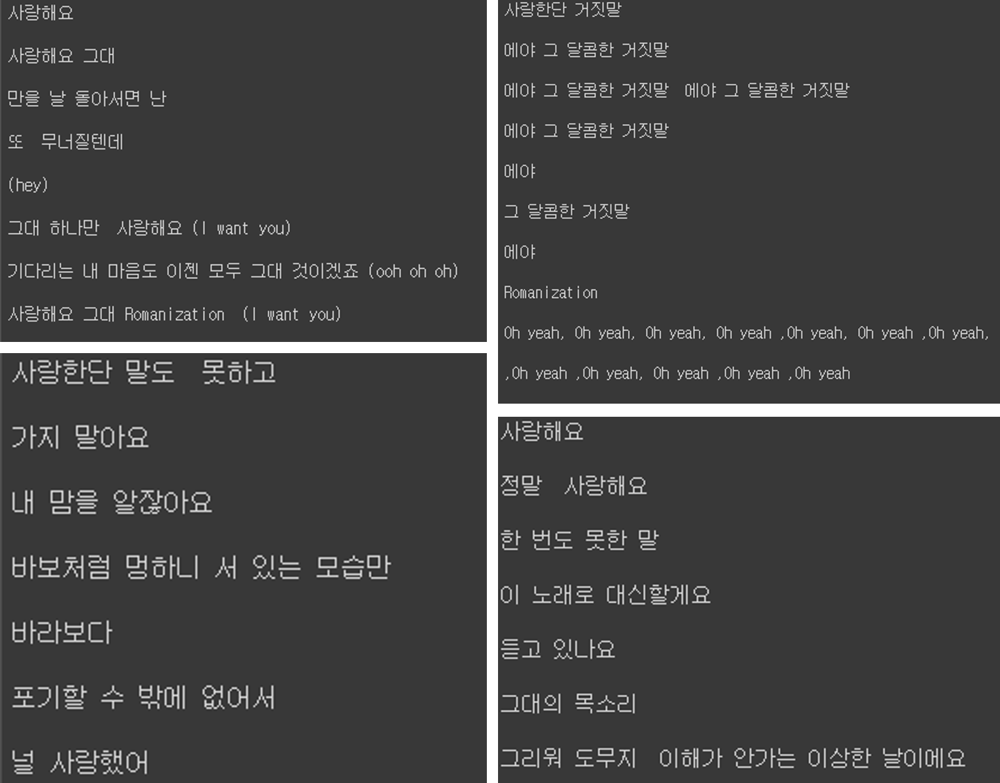
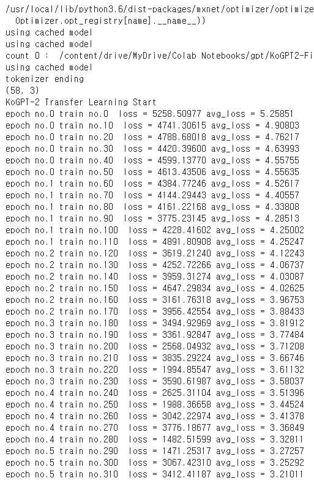
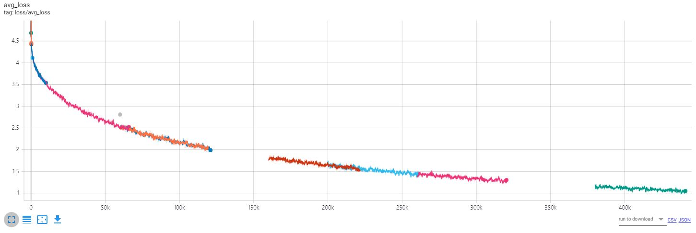

# KoGPT2-FineTuning
[](https://colab.research.google.com/drive/1qfL-IUp4k0uzkr_6SIaAmS_PA_Luvt1t)
[](https://github.com/gyunggyung/KoGPT2-FineTuning/issues)
[](https://github.com/gyunggyung/KoGPT2-FineTuning/issues)
[](https://github.com/gyunggyung/KoGPT2-FineTuning/issues)
[](https://github.com/gyunggyung/KoGPT2-FineTuning)


<del>SKT-AI에서 약 20GB의 한국어 데이터를 Pre-Training 시킨 [KoGPT2](https://github.com/SKT-AI/KoGPT2)를 사용했습니다. 첫 번째로 가사 작사를 위해서, 저작권이 만료된 정제된 가사 데이터, 소설, 기사 등을 Data별로 weight를 다르게 주며 Fine-tuning 하였습니다. 또한 장르도 받아서 음악 장르별 가사 학습 결과를 볼 수 있습니다.</del>

<del>또한 Colab에서는 원활한 학습을 위해서 Google Drive와 [Dropbbox](https://www.dropbox.com/h)을 연동했습니다. 학습한 중간 결과를 Google Drive에서 Dropbbox로 이동시킨 후, Google Drive에서 해당 결과를 삭제하게 합니다. 이와 관련된 [Code](https://github.com/gyunggyung/KoGPT2-FineTuning/blob/master/jupyter_main.py)</del>

SKT-AI에서 약 20GB의 한국어 데이터를 Pre-Training 시킨 [KoGPT2](https://github.com/SKT-AI/KoGPT2)를 사용했습니다. 다음문장 예측 시스템을 구축하기 위해 첫 번째로 그룹웨어의 대화내용 등을 Data별로 weight를 다르게 주며 Fine-tuning 하였습니다. 또한 결과물도 확인할 수 있습니다.

Dropbox 연동을 제거했습니다.

음악 장르별로, CSV 형식의 Dataset을 받는 바뀐 Version 2의 Code로 KoGPT2-FineTuning 작업을 하기 어렵다면, [Version 1.1](https://github.com/forus-ai/KoGPT2-FineTuning)을 이용하길 바랍니다.

아래에서, 다양한 한국어 가사를 학습한 결과를 확인 할 수 있습니다. 우리는 이외에도 다양한 프로젝트를 진행할 것입니다. 

## Sample
  

## Data structure
|weight|type|data|
|---|---|---|
|1000.0|공지|'수신 : 김광륜\n\n 공지사항 안내드립니다. 금일 업무보고서에 대한 제출은...'|

...
##### 3x200000

## Fine Tuning
```
python main.py --epoch=200 --data_file_path=./dataset/lyrics_dataset.csv --save_path=./checkpoint/ --load_path=./checkpoint/genre/KoGPT2_checkpoint_296000.tar --batch_size=1
```

### parser
``` python
parser.add_argument('--epoch', type=int, default=200,
					help="epoch 를 통해서 학습 범위를 조절합니다.")
parser.add_argument('--save_path', type=str, default='./checkpoint/',
					help="학습 결과를 저장하는 경로입니다.")
parser.add_argument('--load_path', type=str, default='./checkpoint/Alls/KoGPT2_checkpoint_296000.tar', 
					help="학습된 결과를 불러오는 경로입니다.")
parser.add_argument('--samples', type=str, default="samples/",
					help="생성 결과를 저장할 경로입니다.")
parser.add_argument('--data_file_path', type=str, default='dataset/lyrics_dataset.txt',
					help="학습할 데이터를 불러오는 경로입니다.")
parser.add_argument('--batch_size', type=int, default=8,
					help="batch_size 를 지정합니다.")
```

### Use Colab
[](https://colab.research.google.com/drive/1x49fRFi-pgW_P8_Av5fCyYVPvT_9btai)

Colab을 이용해서 Fine-tuning Code를 실행할 수 있습니다.  



#### Runtime Disconnection Prevention
``` javascript
function ClickConnect() {
    // 백엔드를 할당하지 못했습니다.
    // GPU이(가) 있는 백엔드를 사용할 수 없습니다. 가속기가 없는 런타임을 사용하시겠습니까?
    // 취소 버튼을 찾아서 클릭
    var buttons = document.querySelectorAll("colab-dialog.yes-no-dialog paper-button#cancel"); 
    buttons.forEach(function(btn) {
		btn.click();
    });
    console.log("1분 마다 다시 연결");
    document.querySelector("#top-toolbar > colab-connect-button").click();
}
setInterval(ClickConnect,1000*60);
```

#### Clear the screen every 10 minutes
``` javascript
function CleanCurrentOutput(){ 
	var btn = document.querySelector(".output-icon.clear_outputs_enabled.output-icon-selected[title$='현재 실행 중...'] iron-icon[command=clear-focused-or-selected-outputs]");
	if(btn) {
		console.log("10분 마다 출력 지우기");
		btn.click();
	}
} 
setInterval(CleanCurrentOutput,1000*60*10);
```

### GPU Memory Check
```
nvidia-smi.exe
```
## generator
```
python generator.py --temperature=1.0 --text_size=1000 --tmp_sent=""
```
#### 표절 없음
```
python generator.py --temperature=5.0 --text_size=500 --tmp_sent=""
```

### parser
``` python
parser.add_argument('--temperature', type=float, default=0.7,
					help="temperature 를 통해서 글의 창의성을 조절합니다.")
parser.add_argument('--top_p', type=float, default=0.9,
					help="top_p 를 통해서 글의 표현 범위를 조절합니다.")
parser.add_argument('--top_k', type=int, default=40,
					help="top_k 를 통해서 글의 표현 범위를 조절합니다.")
parser.add_argument('--text_size', type=int, default=250,
					help="결과물의 길이를 조정합니다.")
parser.add_argument('--loops', type=int, default=-1,
					help="글을 몇 번 반복할지 지정합니다. -1은 무한반복입니다.")
parser.add_argument('--tmp_sent', type=str, default="사랑",
					help="글의 시작 문장입니다.")
parser.add_argument('--load_path', type=str, default="./checkpoint/Alls/KoGPT2_checkpoint_296000.tar",
					help="학습된 결과물을 저장하는 경로입니다.")
```

### Use Colab
[](https://colab.research.google.com/drive/1qfL-IUp4k0uzkr_6SIaAmS_PA_Luvt1t)

Colab을 이용해서 generator를 실행할 수 있습니다.  


## tensorboard
학습에 따른 변화를 확인하기 위해서, [tensorboard](http://localhost:6006/)로 접근하여 loss와 text를 확인합니다.

```
tensorboard --logdir=runs
```

### loss
  

### text


## Citation
```
@misc{KoGPT2-FineTuning,
  author = {gyung},
  title = {KoGPT2-FineTuning},
  year = {2020},
  publisher = {GitHub},
  journal = {GitHub repository},
  howpublished = {\url{https://github.com/gyunggyung/KoGPT2-FineTuning}},
}
```

## Output
자세한 결과물은 [samples](https://github.com/gyunggyung/KoGPT2-FineTuning/tree/master/samples)에서 확인 할 수 있습니다. 학습에 대해서는 [관련 포스팅](https://hipgyung.tistory.com/110)에서 확인할 수 있습니다.

## Reference
> https://github.com/openai/gpt-2  
> https://github.com/nshepperd/gpt-2  
> https://github.com/SKT-AI/KoGPT2  
> https://github.com/asyml/texar-pytorch/tree/master/examples/gpt-2  
> https://github.com/graykode/gpt-2-Pytorch  
> https://gist.github.com/thomwolf/1a5a29f6962089e871b94cbd09daf317  
> https://github.com/shbictai/narrativeKoGPT2  
> https://github.com/ssut/py-hanspell  
> https://github.com/likejazz/korean-sentence-splitter  
